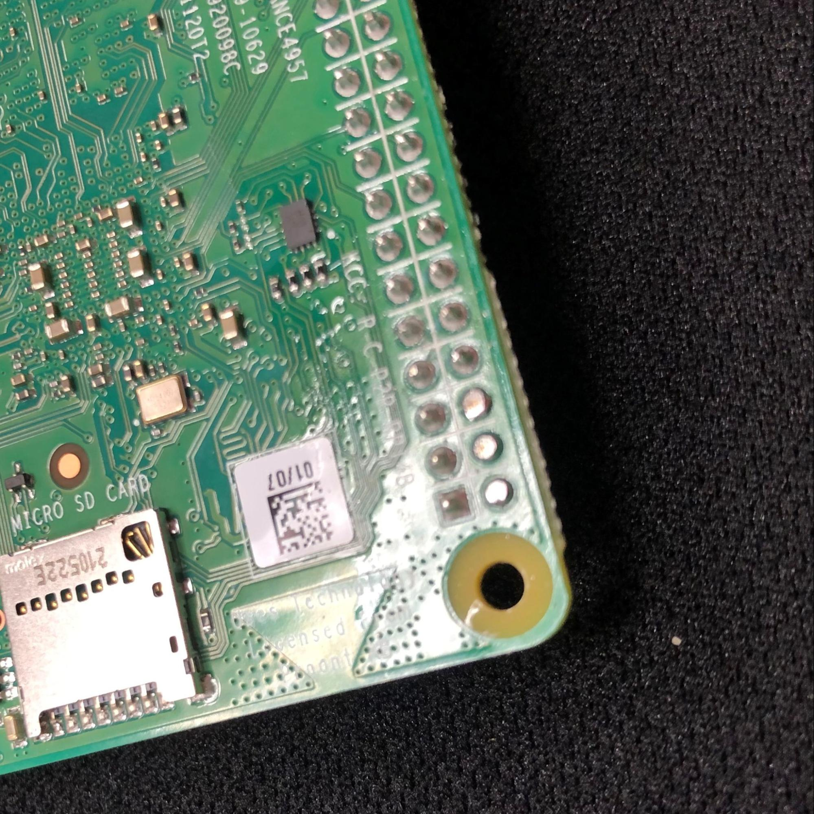

<h2>Pi installation</h2>

The Prometheus MSLA controller board ( APOLLO ) is a carrier board for the raspberry pi 4B. 
The communication and power transfer for the pi is made via spring pins ( pogo pins ). They 
connect to pads under the pi for a seamless interface. The pogo pins are very fragile and precise 
components so some of the pads on the pi need to be modified for a good connection, and to 
reduce the risk of breaking them.

<h3>Step1</h3>

With a good pair of flush cutters, cut the first 3 pins of the GPIO pins as flush as possible. 
These pins are #2 - 4 - 6 (5V - 5V - GND )

<h3>Step2 (optional)</h3>

With a small file or a soldering iron smooth the surface of these cut pins so the 
pogo pins can have better contact on the pads.

It should look something like this.

<h3>Step3</h3>

With a sharp point or a soldering iron, scrape or heat the contact test pads. This  
procedure will ensure to remove any potential oxide layer that can prevent the pogo pins from 
having a good connection to the pi. 
<b>*The important pads are ( TP17, TP10, TP6 )</b>

<h3>Step4</h3>

You can now carefully install the pi on the board using the 4 M2.5 screws. 
Don’t over tighten the screws to prevent crushing the pogo pins (look at them while screwing). 
<b>* We strongly suggest installing a proper heatsink on your pi.</b>

