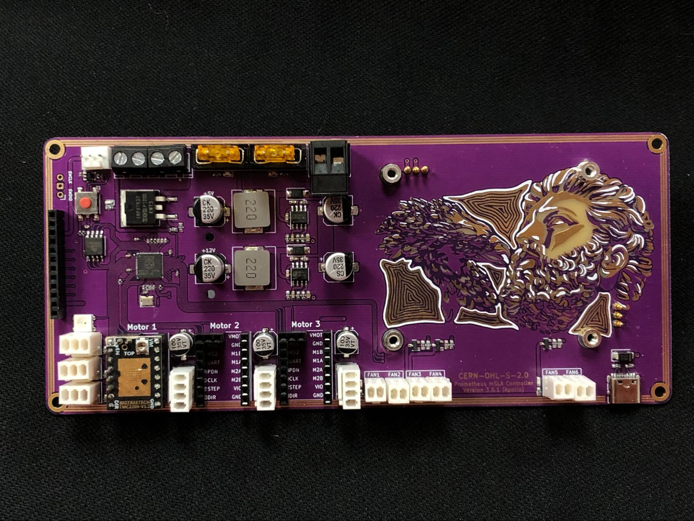

The Prometheus MSLA controller board (**Apollo**) is the official controller/motherboard for the Prometheus MSLA printer.

The motherboard is fully open source ([under the license CERN-OHL-S-2.0](https://ohwr.org/cern_ohl_s_v2.pdf)) so it can be used in other similar machines and more.
All documentation for it can be found [on the Apollo Github](https://www.github.com/TheContrappostoShop/Apollo/)

## Disclaimer
Please make sure to read and follow the following instructions for your Apollo motherboard to avoid any damages or any broken components.
