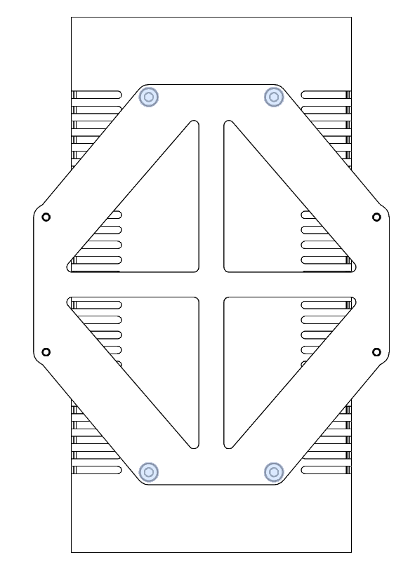

### Electronics Preparation

We recommend doing the most of the electronic assembly outside the frame because it will become very tight later.
First mount the braket on your power supply using the appropriate screws.

M4x8 SHC (4)

The rest of the modules mount without any screws in their brakets. You can mount everything in place on the base plate with the appropriate screws.

Everything should fit on with the same screws. Look at the proper orientation of the plate and components in the pictures. When everything is mounted, set the plate aside and begin working on [the frame](./frame.md).