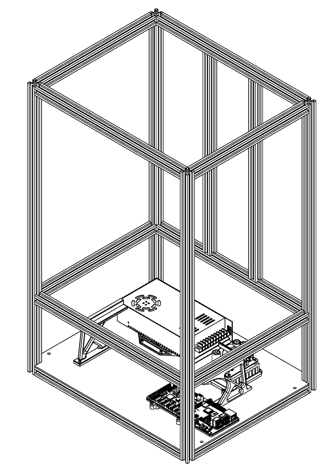

### Frame Assembly

??? info "Connecting your extrusions"

    There are a handful of different ways to assemble the frame sections:
    Hidden Connectors, which are easier to use if you have limited access to tools, or Blind Joints, which require additional holes to be drilled, and for the ends of the extrusions to be tapped. Most Prometheus Kit Suppliers provide extrusions prepared for Blind Joints. 

We recommend assembling your frame in the following order, to ensure a smooth process:

#### Corner Extrusions

Assemble the firsts extrusion bars together like so.
2020 412mm (2)
2020 324mm (2)
2020 705mm (4)

#### Base Plate Installation

Slide the base plate (with all of the components affixed in the [electronics section](./electronics.md)) and fix it in place. The motherboard will need to have a spacer under it if you bought a Prometheus kit.

M3x18 SHC (16)
M5x8 SHC (4)
M5 T-nut (4)

### Finalize The Frame

??? info "Wait before tightening the Z axis extrusions"

    We suggest waiting before tightening the screws for the two extrusion bars at the back because we will use the printer arm later to align and make everything parallel.  

2020 324mm (4)
2020 412mm (4)
2020 490mm (2)

When you are happy with the squareness of your frame you can now jump on [the kinematic](./kinematic.md).