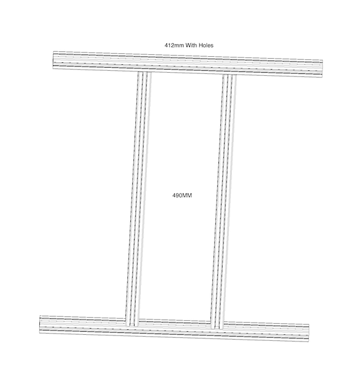

### Frame Assembly

??? info "Connecting your extrusions"

    There are a handful of different ways to assemble the frame sections:
    Hidden Connectors, which are easier to use if you have limited access to tools, or Blind Joints, which require additional holes to be drilled, and for the ends of the extrusions to be tapped. Most Prometheus Kit Suppliers provide extrusions prepared for Blind Joints. 

!!! note "Make your life a bit easyer"

    To help with finding the extrutions. Label each one with there length with a fine tip perminent marker.

We recommend assembling your frame in the following order, to ensure a smooth process:

#### Preassembly

To help speed things up preinstall the SHC M3x18mm in to the ends of these extrutions leaving a 1mm gap.

| Frame Size | QTY |
|------------|-----|
| 324mm      | 6   |
| 412mm      | 6   |  
| 490mm      | 2   |
|            |     |

#### Corner Extrusions

Assemble the firsts extrusion bars together like so.

| Frame Type | Size  | qty |
|------------|-------|-----|
| 2020       | 412mm | 2   |
| 2020       | 324mm | 2   |
| 2020       | 705mm | 4   |
|            |       |     |

#### Base Plate Installation

Slide the base plate (with all of the components affixed in the [electronics section](./electronics.md)) and fix it in place. The motherboard will need to have a spacer under it if you bought a Prometheus kit.

| Item    | Type  | qty |
|---------|-------|-----|
| M3x18mm | SHC   | 16  |
| M5x8mm  | SHC   | 4   |
| M5      | T-nut | 4   |
|         |       |     |

### Finalize The Frame

??? info "Wait before tightening the Z axis extrusions"

    We suggest waiting before tightening the screws for the two extrusion bars at the back because we will use the printer arm later to align and make everything parallel. 

#### Build the Z axis H frame

You will want to mount the 2020 490mm will mount on to the 2 2020 412mm that have blind holes drilled in them.  Make sure to keep these joins very lose.

Now slide Z axis H frame in to main frame.

Image here 

| Item | Size  | qty | Notes |
|------|-------|-----|-------|
| 2020 | 412mm | 2   | Will have blind join holes for Z axis |
| 2020 | 490mm | 2   | |
|      |       |     | |

#### The rest of the frame

| Item | Size  | qty | Notes |
|------|-------|-----|-------|
| 2020 | 324mm | 4   | |
| 2020 | 412mm | 2   | |
|      |       |     | |

When you are happy with the squareness of your frame you can now jump on [the kinematic](./kinematic.md).