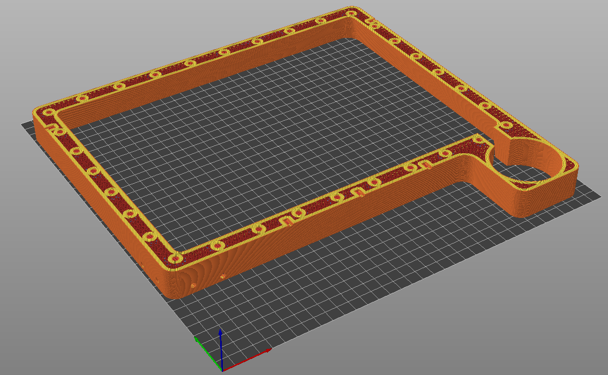

### 3D Printed Parts
The Prometheus MSLA printer is a MSLA printer so the process about choosing the right filament for the job is not the same as a FDM (filament) printer. Resin contains a lot of chemicals that can react with various materials. With that in mind what we suggest for all the parts that is or potentionaly is in contact with resin to print them in a compatible or resistant material. There is also a big selection of blends or "plus" filament that can play with the results too. We suggest to make tests with resin to see the impact on your filament.

Material that we suggest is PLA and PC due to its strong and stiff property. It also resist very well to the chemical inside the composition of resin.
(Other plastics like PETG and PP are possible but have different physical property and would need to be tested)

Materials that we not suggest are Styrene based filament like ABS and ASA. Those will react with chemicals and potentialy the fume coming from the resin.

### Slicer and printer settings
There is few parts like the vat, vat ring and lcd braket that are oversized and will not fit in most of 3D printer. You will need to have access to a printer of at least 350mmx350mm print area. If ever you don't have acces to that kind of printer their is a splitted version of those parts. This is still in experimentation and might not be the beast due to big stress coming from the tensioned FEP under the vat. You can also look at PCBWay that can print those parts for you. Discount and associate link : https://pcbway.com/g/SGgRFv 

