### Z Motor

Install the shaft coupler onto the NEMA17 motor.

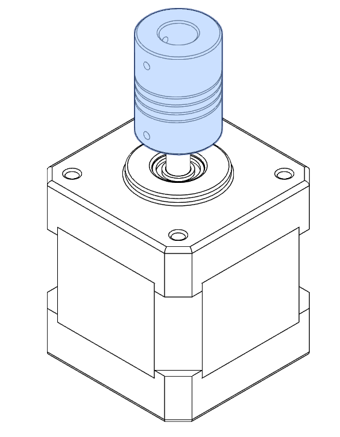

Install the 3D printer motor mount onto the motor.

M3x20 Countersunk (4)

Finally install this braket onto Your frame.
??? info "Wait before tightening the motor mount"

    We suggest waiting before tightening the screws for the motor mount so everything can be perfectly aligned and centered.  

M5x16 SHC (4)
M5 T-nut (4)

### Ball Screw Installation

You will only need to install  the base bearing support for the ball screw build (BK12 or BK10). Because cheap ball screws can have a lot of wobble we need to constraint as less as possible this wobbling movement so it will not be introduced into the arm as much. Also there is no side to side load so we don't really need the top bearing support. We also developed a fix for that on our youtube channel. https://www.youtube.com/watch?v=gq82FTh7mtk&t=374s

M5 nut (4)

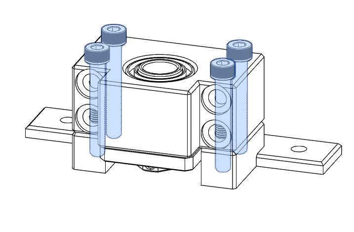

M5x35 SHC (4)

Insert the ballscrew into the assembly (the ballscrew nut can stay installed if it's already install)

Try to center as much as possible the ballscrew assembly.

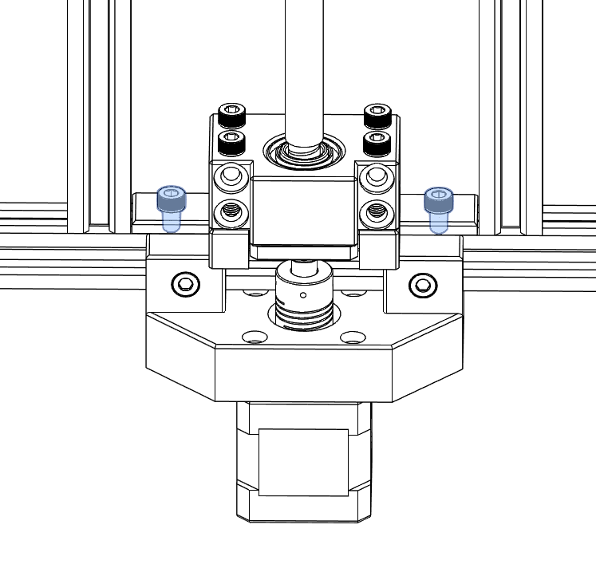

M5x8 SHC (2)
M5 T-nut (2)

### Linear Rails Installation

It's now time to install the linear rails onto the Z axis extrusion bar at the back. There are a few tools available online you can use to center those rails onto the extrusion bar.

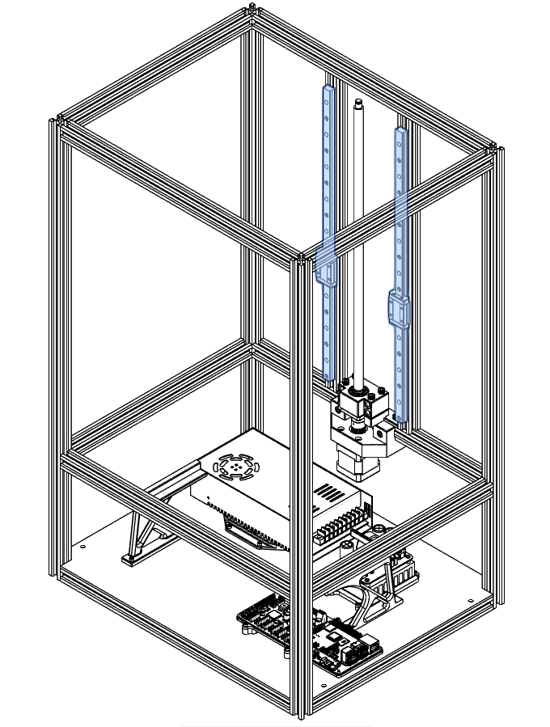

M3x8 SHC (18)
M3 T-nut (18)

### Build Arm Assembly

Before installing the ballscrew nut onto the assembly we need to install the nuts under the 3D printed Arm Spacer.

M4 nut (4)

This step can be done later or separately if you already have the ballscrew nut installed onto the ballscrew.

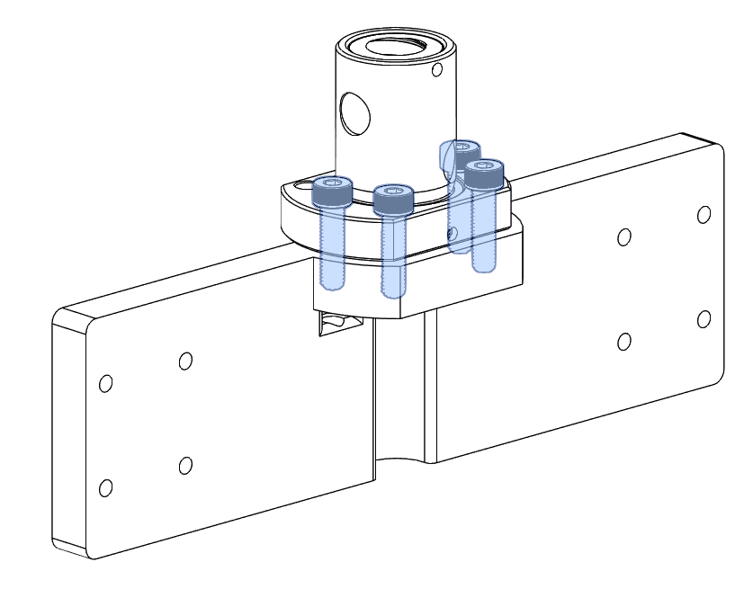

M4x16 SHC (4)

Before fixing the build arm parts we suggest to install the inductive probe trigger onto the 3D printed Plates Link part.

??? info "LocTite the trigger screw"

    We suggest using thread locker onto the M4 screw used to trigger the inductive probe because it came become loose due to vibration and mess up your leveling or worst.  

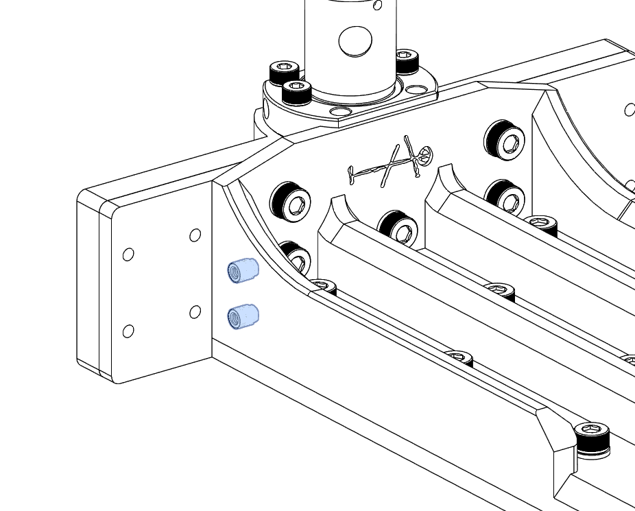
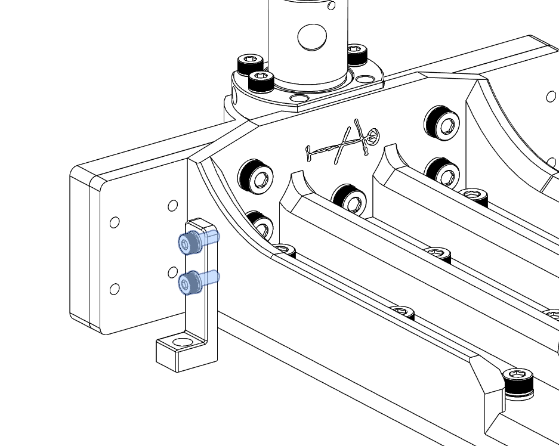

M3 Insert (2)
M4 Insert (1)
M3 Washer (2)
M3x8 SHC (2)
M4x10 SHC (1)

The build arm parts now need to be assemble and fixed together. Both plates for the arm should be already taped by the kit supplier.

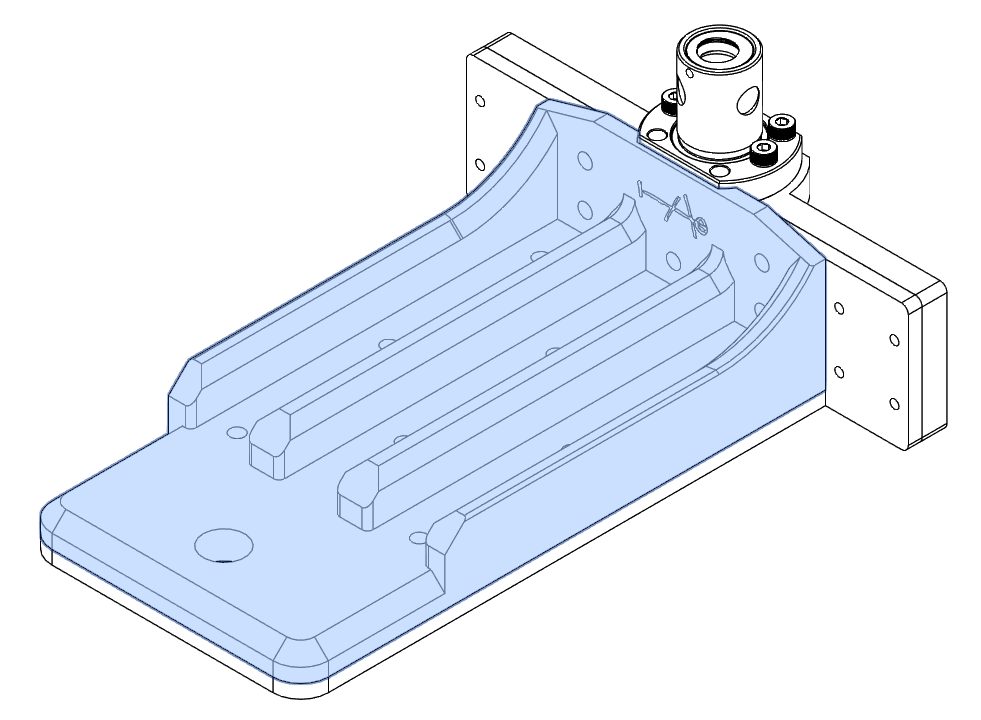

M5x8 SHC (14)

### Build Plate Assembly

This step can be done later because we can wait before installing the build plate onto the arm. We suggest to wait after the calibration process so nothing can break or crash if something is wrong !

Into the 3D printed Buidl Plate Link part install the heatset insert.

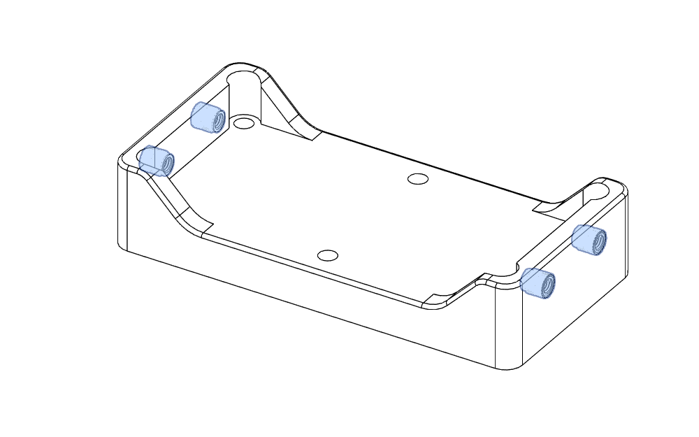

M4 Insert (4)

Install that part onto the build plate.

??? info "Greace the threaded hole"

    We suggest to use some kind of greace into the build plate holes to facilate  futur removal. Resin can leak under the printed part and go into the threads. This can jam the screws in place and add difficulties to remove those screws. 

M5x16 SHC (6)

In this step we suggest to not tighten up the leveling screws on the sides of the build plate because we can't level everything just yet. You can then install the build plate onto the arm if you wish by installing the setscrew into the knob.

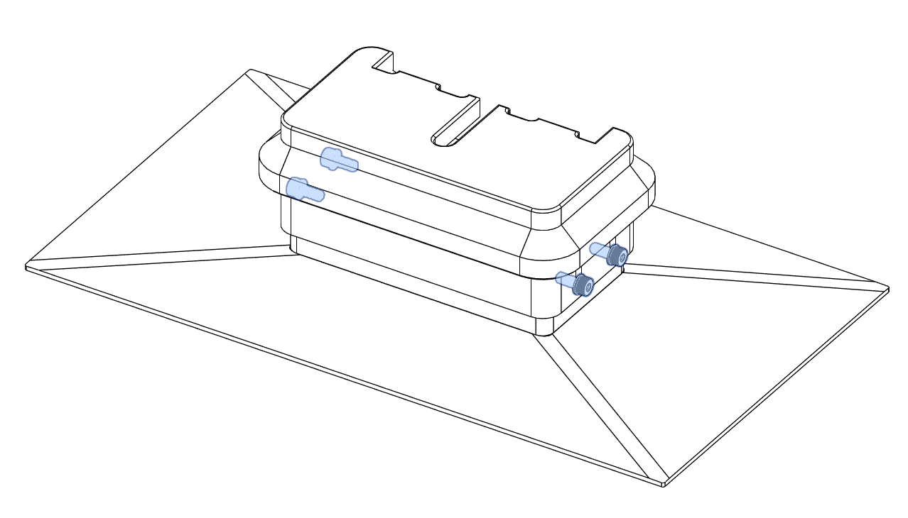

M4 Washer (4)
M4x10 SHC (4)
M8x50 set screw (1)

The build arm is simply fixed onto the linear guides.

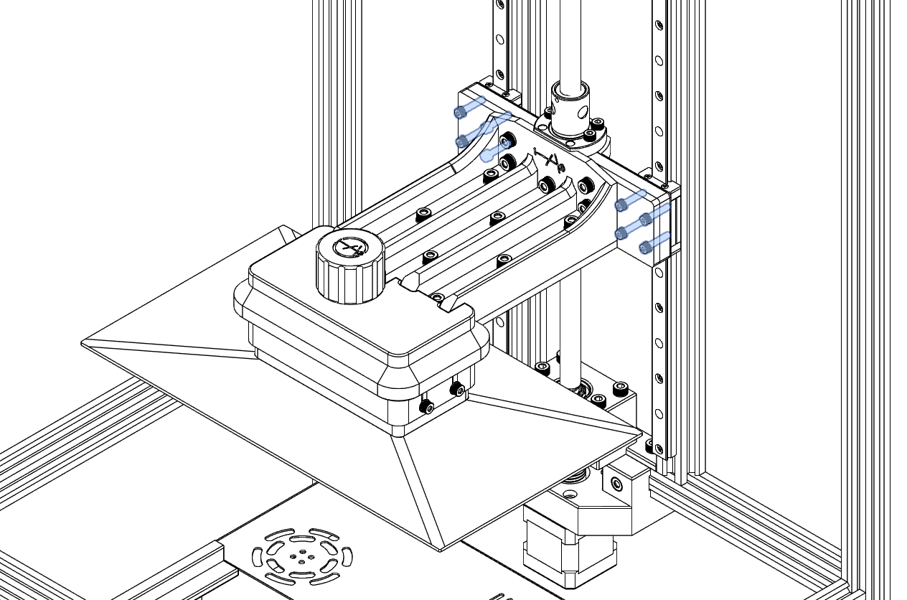

M3 Washer (8)
M3x18 SHC (8)

To finalize everything this is when you should tighten the loose screws. First we suggest to move the build arm almost all the way down. This is when you can tighten the motor mount and the screws under the Z axis extrusion bar. Now move (by hand) your build arm all the way up and tighten the remaining screws at the top of the Z axis extrusion bar. This process ensures that the rails are properly spaced. They will naturaly place themselves.

When everything goes up and down smoothly we can prepare for [the middle plate](./middleplate.md).